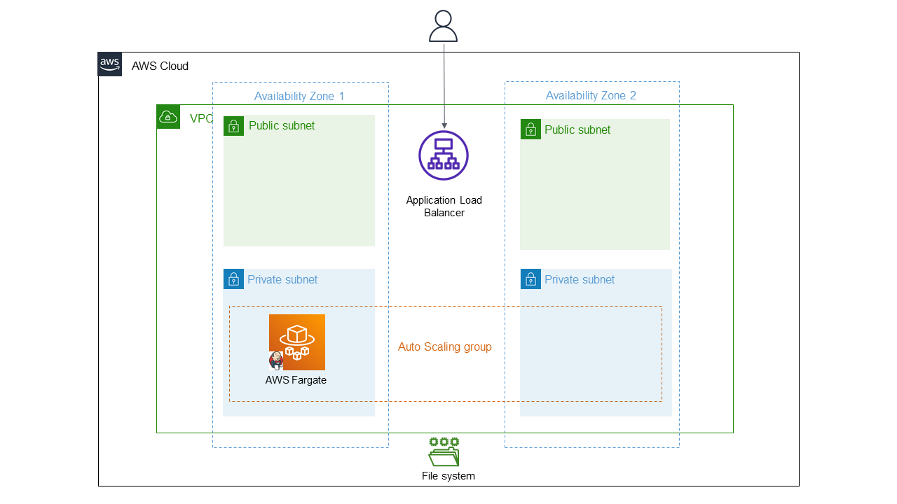
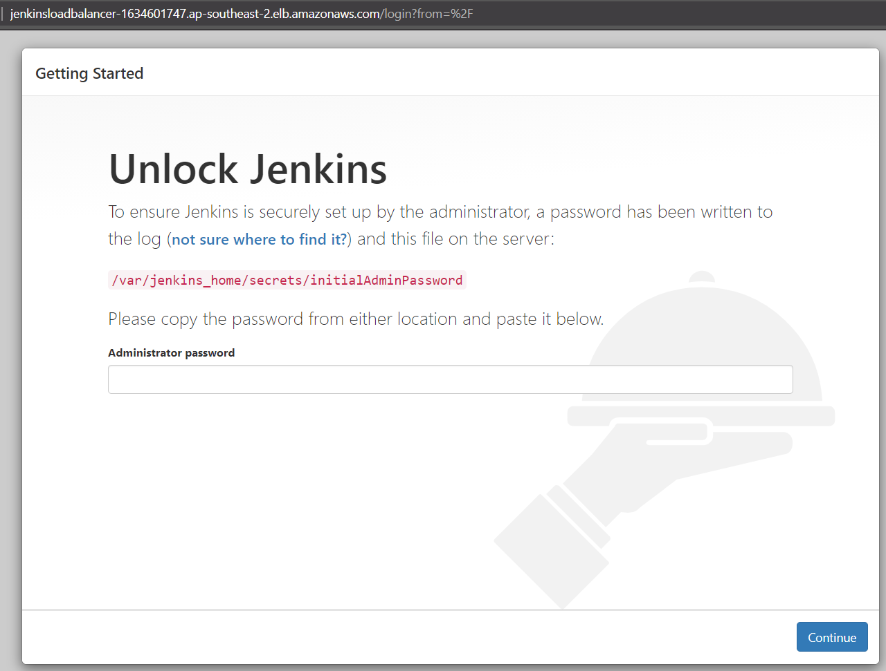

# Jenkins on AWS
A Terraform module to create the required resources and infrastructure for [Jenkins](https://www.jenkins.io/) on AWS.

This Terraform module allows you to deploy Jenkins in a cluster using:
* ECS Fargate as the compute engine
* Jenkins running on a private subnet
* Integration with Application Load Balancer (ALB)
* Persistent storage using EFS

## Architecture 

## End Result

## Roadmap
- [ ] Add further details about the elements/resources
- [ ] Running with ECS Slave Agents
- [ ] Add Terraform Tests